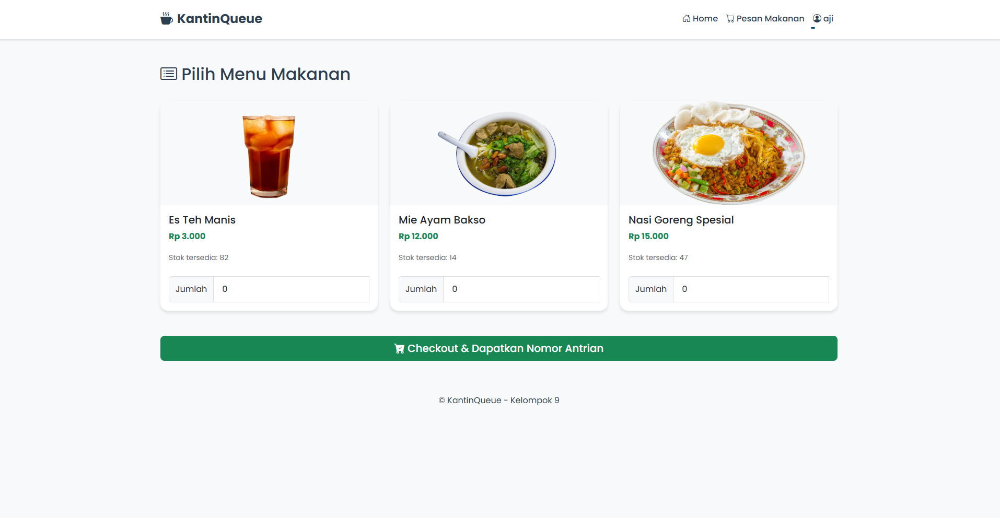
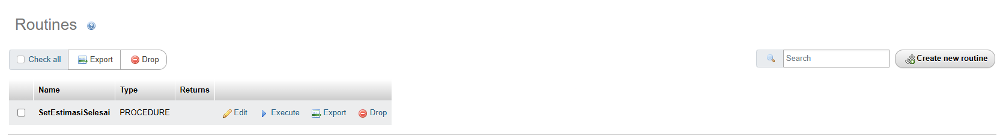
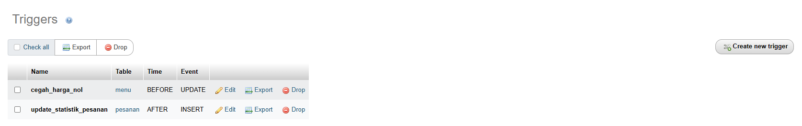

# 🥪 KantinQueue (Proyek UAP Pemrosesan Data Terdistribusi)

**KantinQueue** adalah sistem manajemen kantin digital yang dibangun menggunakan **PHP Native** dan **MySQL**. Sistem ini dirancang untuk membantu pengelolaan antrian dan transaksi di kantin secara **aman, konsisten, dan efisien**, khususnya saat melayani banyak pengguna secara bersamaan.

Proyek ini merupakan implementasi dari konsep **Pemrosesan Data Terdistribusi**, yang menempatkan sebagian besar logika bisnis langsung di lapisan database untuk meningkatkan performa, keandalan, dan integritas data.

🔧 Fitur-fitur utama yang diimplementasikan dalam proyek ini:

- ✅ **Stored Procedure** — Menangani proses bisnis utama seperti pemesanan dan pengelolaan stok.
- ✅ **Stored Function** — Menghitung estimasi waktu tunggu dan metrik lainnya secara dinamis.
- ✅ **Trigger** — Menjaga integritas data secara otomatis saat terjadi perubahan di tabel penting.
- ✅ **Transaction** — Memastikan proses antrian dan transaksi berjalan secara atomik.
- ✅ **Backup Otomatis** — Melindungi data penting dengan pencadangan rutin berbasis jadwal.

Sistem ini juga dilengkapi fitur **login pengguna**, serta dokumentasi teknis lengkap agar dapat dikembangkan dan diadaptasi lebih lanjut sesuai kebutuhan institusi.



## 📌 Detail Konsep

⚠️ **Disclaimer**  
Peran stored procedure, trigger, transaction, stored function, dan backup dalam proyek ini dirancang khusus untuk kebutuhan sistem **KantinQueue**. Penerapannya bisa berbeda pada sistem lain, tergantung arsitektur dan kebutuhan masing-masing sistem.


## 🧠 Stored Procedure

Stored procedure `SetEstimasiSelesai` digunakan untuk menghitung estimasi waktu selesai pesanan secara otomatis. Prosedur ini akan memanggil function `HitungEstimasiMenit`, lalu memperbarui kolom `estimasi_selesai` pada tabel `pesanan`.



```sql
DELIMITER $$
CREATE DEFINER=`root`@`localhost` PROCEDURE `SetEstimasiSelesai` (IN `pesanan_id` INT)
BEGIN
    DECLARE estimasi_menit INT;
    SET estimasi_menit = HitungEstimasiMenit();
    UPDATE pesanan
    SET estimasi_selesai = DATE_ADD(CURRENT_TIMESTAMP, INTERVAL estimasi_menit MINUTE)
    WHERE id_pesanan = pesanan_id;
END$$
DELIMITER ;
```


## 🚨 Trigger

Dalam sistem **KantinQueue**, trigger bertindak sebagai *penjaga otomatis* di level database yang langsung bereaksi ketika data diubah atau ditambahkan. Ini penting untuk menjaga integritas dan akurasi data, tanpa bergantung sepenuhnya pada sisi aplikasi.



### 🛑 Trigger `cegah_harga_nol`

Trigger ini memastikan harga menu tidak kurang dari Rp 1.000. Ia aktif sebelum data di-*update* ke tabel `menu`.

```sql
DELIMITER $$
CREATE TRIGGER `cegah_harga_nol` 
BEFORE UPDATE ON `menu` 
FOR EACH ROW 
BEGIN
    IF NEW.harga < 1000 THEN
        SIGNAL SQLSTATE '45000' SET MESSAGE_TEXT = 'Error: Harga menu tidak boleh kurang dari Rp 1.000!';
    END IF;
END$$
DELIMITER ;
```
### 📊 Trigger `update_statistik_pesanan`

Trigger ini secara otomatis mencatat setiap pesanan yang masuk ke dalam tabel statistik harian. Dengan ini, admin kantin dapat memantau jumlah transaksi harian tanpa perlu menambahkan logika tambahan di sisi aplikasi.

```sql
DELIMITER $$
CREATE TRIGGER `update_statistik_pesanan` 
AFTER INSERT ON `pesanan` 
FOR EACH ROW 
BEGIN
    INSERT INTO statistik_harian (tanggal, total_pesanan_masuk)
    VALUES (CURDATE(), 1)
    ON DUPLICATE KEY UPDATE total_pesanan_masuk = total_pesanan_masuk + 1;
END$$
DELIMITER ;
```
## 🔄 Transaction 

Dalam sistem **KantinQueue**, transaksi dikelola dengan prinsip **semua-atau-tidak sama sekali** (*atomicity*). Artinya, seluruh proses checkout (mulai dari input pesanan, detail, hingga pengurangan stok) dijalankan dalam satu blok transaksi. Jika salah satu langkah gagal, maka semua perubahan dibatalkan agar integritas data tetap terjaga.

---

### 🔁 Proses Checkout dengan Transaksi

Ketika mahasiswa melakukan checkout keranjang, sistem menjalankan alur berikut:

1. **Kadaluarsa Otomatis**  
   Mengecek dan menandai pesanan sebelumnya yang statusnya `dipesan` dan tidak diproses selama lebih dari 15 menit menjadi `kadaluarsa`.

2. **Generate Nomor Antrian Otomatis**  
   Nomor antrian baru di-generate berdasarkan data pesanan terakhir (`A-001`, `A-002`, dst).

3. **Hitung Total Harga**  
   Sistem menghitung total harga seluruh item di dalam keranjang.

4. **Insert Pesanan & Detail**  
   Data dimasukkan ke tabel `pesanan` dan `detail_pesanan`.

5. **Update Stok Menu**  
   Mengurangi stok masing-masing menu sesuai jumlah yang dibeli.

6. **Panggil Stored Procedure `SetEstimasiSelesai`**  
   Estimasi waktu selesai diset berdasarkan kalkulasi dari database.

7. ✅ **Commit jika Berhasil**, ❌ **Rollback jika Gagal**  
   Jika semua proses berhasil, data di-*commit*. Jika ada error di tengah jalan, semua proses dibatalkan agar tidak ada data parsial tersimpan.

---

### 🧠 Contoh Struktur Transaksi

```php
$this->db->beginTransaction();

try {
    // Proses insert, update, dan call procedure...
    $this->db->commit(); // ✅ Simpan semua perubahan jika sukses
} catch (Exception $e) {
    $this->db->rollBack(); // ❌ Batalkan semua perubahan jika gagal
}
```

## 📺 Stored Function

Dalam sistem **KantinQueue**, stored function berperan seperti **layar monitor** — hanya membaca dan menampilkan data, tanpa mengubah isi database.

Function ini digunakan untuk mengambil informasi penting dengan cara yang efisien, terpusat, dan konsisten. Hal ini sangat membantu dalam mencegah duplikasi logika dan memastikan keakuratan data.

---

### 🔍 Contoh: `total_pesanan_mahasiswa`

Function `total_pesanan_mahasiswa` berguna untuk menghitung total jumlah pesanan yang telah dilakukan oleh mahasiswa tertentu, berdasarkan `id_mahasiswa`.

#### 📦 MySql Function

```sql
DELIMITER $$

CREATE FUNCTION `total_pesanan_mahasiswa` (`id_mhs` INT) 
RETURNS INT
DETERMINISTIC
BEGIN
    DECLARE total INT;
    SELECT COUNT(*) INTO total
    FROM pesanan
    WHERE id_mahasiswa = id_mhs;
    RETURN total;
END$$

DELIMITER ;
```
#### 💡 Contoh Pemanggilan
```sql
SELECT total_pesanan_mahasiswa(3) AS total_pesanan;
```

## 🔄 Backup Database

Untuk menjaga **integritas** dan **keamanan data**, sistem **KantinQueue** dilengkapi fitur **backup otomatis** yang dijalankan menggunakan skrip PHP dan tool `mysqldump` bawaan MySQL (via Laragon).

Backup dilakukan secara rutin dan hasilnya disimpan dalam folder `backupdatabase/` dengan penamaan file berdasarkan timestamp.

---

### 💡 Fitur Backup

- Menggunakan `mysqldump` untuk menyalin seluruh isi database `kantinqueue_db`.
- Format nama file: `kantinqueue_backup_YYYY-MM-DD_HH-MM-SS.sql`.
- Hasil backup disimpan ke folder `backupdatabase/` di root project.
- Proses dijalankan lewat PHP (bisa dijadwalkan via Task Scheduler atau pemanggilan manual).

---

### ⚙️ Kode Backup

File PHP berikut dapat kamu tempatkan misalnya di `backup.php`:

```php
<?php
date_default_timezone_set('Asia/Jakarta');
$mysqldump_path = 'C:\laragon\bin\mysql\mysql-8.0.30-winx64\bin\mysqldump.exe';

require_once __DIR__ . '/app/init.php';
$backup_dir = __DIR__ . '/backupdatabase';
if (!is_dir($backup_dir)) {
    mkdir($backup_dir, 0777, true);
}

$date = date('Y-m-d_H-i-s');
$backup_file_path = $backup_dir . "/kantinqueue_backup_$date.sql";

$password_arg = defined('DB_PASS') && DB_PASS ? '-p"' . DB_PASS . '"' : '';

$command = sprintf(
    '"%s" --user=%s %s --host=%s %s > "%s"',
    $mysqldump_path,
    DB_USER,
    $password_arg,
    DB_HOST,
    DB_NAME,
    $backup_file_path
);

exec($command, $output, $return_var);

if ($return_var === 0 && file_exists($backup_file_path)) {
    $log_message = date('Y-m-d H:i:s') . " - SUKSES: Backup berhasil disimpan ke: " . $backup_file_path;
    echo $log_message;
} else {
    $log_message = date('Y-m-d H:i:s') . " - GAGAL: Proses backup database gagal. Kode Error: $return_var. Perintah: $command";
    echo $log_message;
}
?>
```
## 📁 Struktur Direktori

Struktur proyek ini diorganisir mengikuti pola desain **MVC (Model-View-Controller)** untuk memisahkan antara logika bisnis, interaksi data, dan tampilan. Ini membuat kode lebih terstruktur, mudah dikelola, dan skalabel.

```bash
KantinQueue/
├── app/
│   ├── config/
│   │   └── config.php          # Konfigurasi database & URL
│   ├── controllers/
│   │   ├── AuthController.php
│   │   ├── HomeController.php
│   │   └── OrderController.php
│   ├── core/
│   │   ├── App.php             # Router utama aplikasi
│   │   ├── Controller.php      # Controller dasar
│   │   └── Database.php        # Kelas untuk koneksi DB
│   ├── models/
│   │   ├── Menu_model.php
│   │   ├── Order_model.php
│   │   └── User_model.php
│   ├── views/
│   │   ├── auth/
│   │   ├── home/
│   │   ├── order/
│   │   └── templates/
│   └── init.php                # File inisialisasi (bootstrap)
│
└── public/
    ├── .htaccess               # Aturan untuk URL bersih
    └── index.php               # Titik masuk tunggal (single entry point)
```
---

## 👥 Kontributor Kelompok 9
- [Muhammad Nur Faadil](https://github.com/bugsm)
- [Ananda Anhar Subing](https://github.com/anndaanhr) 
- [Syahdam Riski Firdaus](https://github.com/syahdamrzyy)

---
